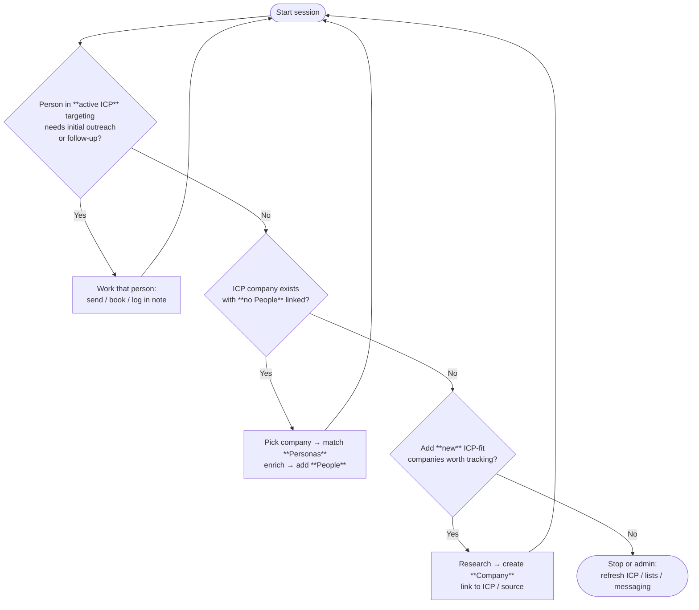

# Meeting booking — daily loop

Work **people → empty companies → new companies**, then repeat from the top.

**Tweak later:** define “active ICP” and “needs work” using your fields (`outreach_status`, `next_step_date`, `outreach_wave`, Bases view, etc.).
