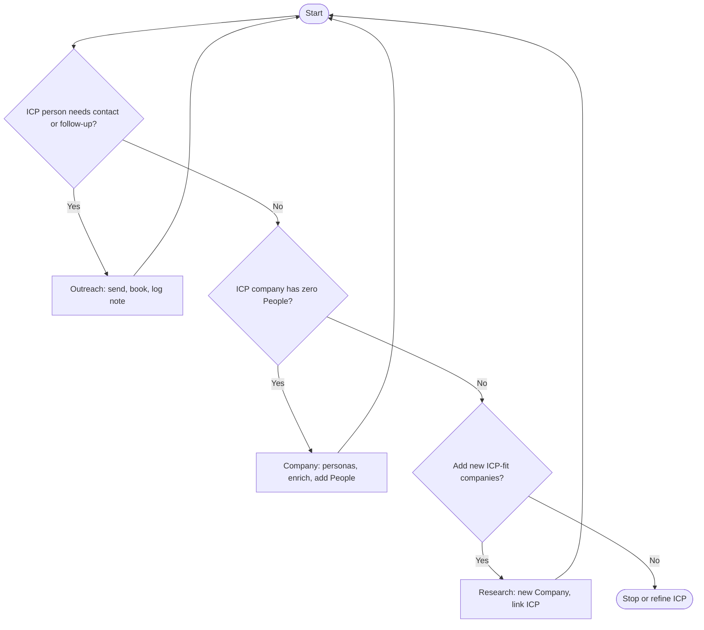

# Meeting booking — daily loop

Priority: **people → companies without people → new companies.** After each action, go back to step 1.

## Text loop (always readable)

1. **Person ready?** — Someone in your current ICP targeting who needs first touch or follow-up → work them (send, book, log) → **go to 1**
2. **Else, empty company?** — ICP-listed company with no People → pick persona fit, enrich, add People → **go to 1**
3. **Else, add targets?** — Research new ICP-fit companies, create Company, link ICP → **go to 1**
4. **Else** — Stop or do admin (refresh ICP, lists, messaging).

## Chart (Mermaid)

Use Reading view or a Mermaid-capable preview. Labels are one line each (no HTML, no markdown inside nodes).

## Tweak later

Define “needs contact” with your fields (`outreach_status`, `next_step_date`, `outreach_wave`, Bases, etc.).
