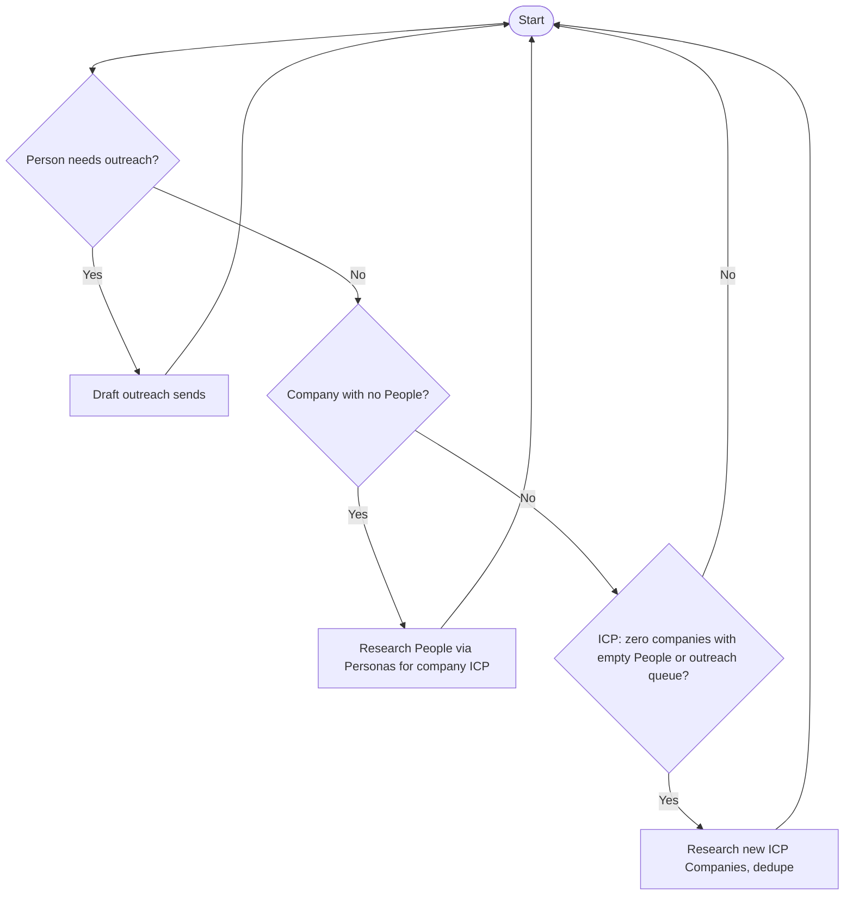

# Meeting booking — daily loop

Always **start from the top** after each action.

## Text loop

1. **If** there is a person that needs outreach → **draft outreach sends** in outreach sends vault → go to top
2. **Else if** there is a company that has no People assigned → **research People** (from **Personas** tied to that company’s **ICP**) → go to top
3. **Else if** the ICP has **no** companies that **either** have empty People **or** have People needing outreach → **research new companies** that match the ICP and **dedupe** → go to top
4. **Else** → go to top (re-scan; or stop if you choose a time box)

Step 3 means: expand the company list only when nothing in the ICP is left that is “empty accounts” or “conversations to run.”

## Chart (Mermaid)

One-line node labels. Reading view or Mermaid-capable preview.

## Tweak later

Define “needs outreach” and queue order using your fields and Bases. Typical queue: `outreach_status` in **`To Contact`** or **`Follow-up due`**, plus `next_step_date` and `Outreach Sends` for context.
