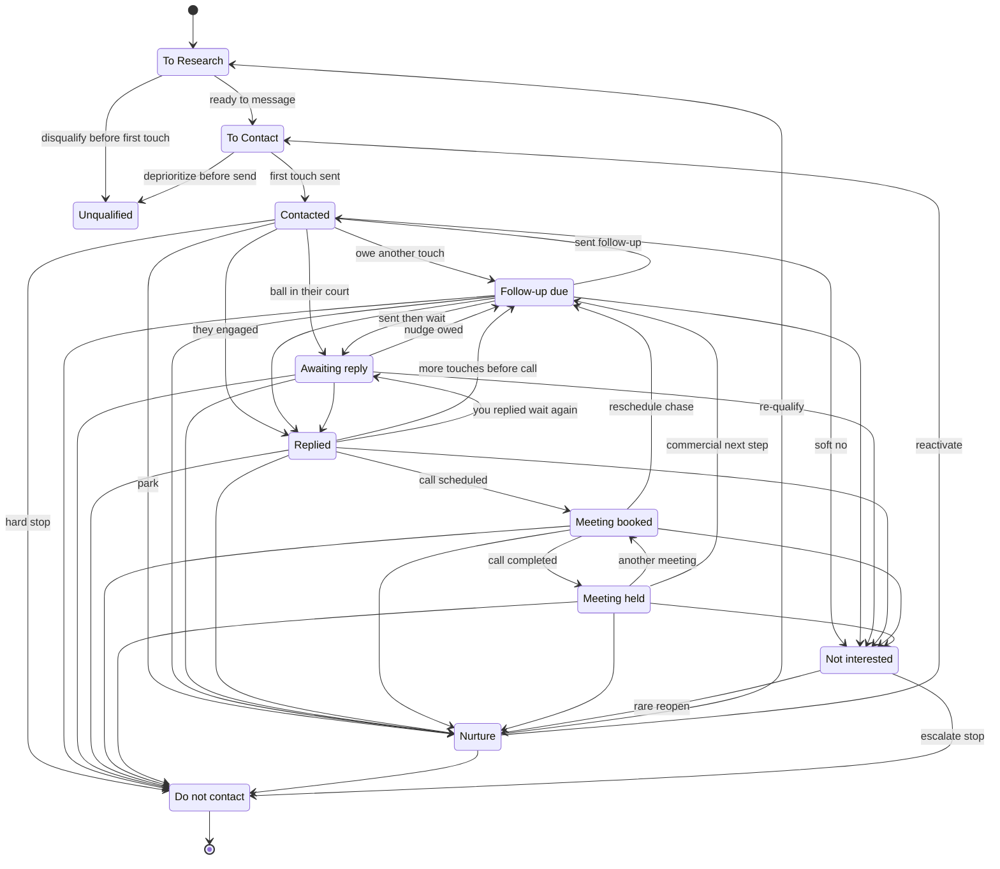

# Person `outreach_status` — full state machine

Canonical strings and order: `_schemas/allowlists/person-outreach-status.json` (must match Metadata Menu on `Person`).

## Happy path (outbound → meeting)

`To Research` → `To Contact` → `Contacted` → (`Follow-up due` ↔ `Awaiting reply`)\* → `Replied` → `Meeting booked` → `Meeting held`

\*Many teams bounce between **Follow-up due** (you owe a touch) and **Awaiting reply** (ball in their court) several times.

## Early exit from research

`To Research` → **`Unqualified`** — poor ICP/persona fit, wrong person, or “not worth a first message” **before** a real first touch. (Different from **Not interested**, which is usually after some engagement.)

## Long arc / exits (from many states)

| State            | Meaning                                | Typical entry from                  |
| ---------------- | -------------------------------------- | ----------------------------------- |
| `Nurture`        | Right account/person, wrong timing     | Almost anywhere after some signal   |
| `Not interested` | Soft no / pass                         | After contact or meeting            |
| `Do not contact` | Hard stop (opt-out, never, compliance) | **Any** prior state (use sparingly) |

`Do not contact` is **terminal** in this model: no outbound transitions (override only with a clear policy, e.g. re-consent).

## Transition matrix (allowed moves)

Rows = **from**, cells = **to**. ✓ common / allowed, ~ rare / needs a reason, — usually avoid.

| From ↓ / To →      | To Research | Unqualified | To Contact | Contacted | Follow-up due | Awaiting reply | Replied | Meeting booked | Meeting held | Nurture | Not interested | Do not contact |
| ------------------ | ----------- | ----------- | ---------- | --------- | ------------- | -------------- | ------- | -------------- | ------------ | ------- | -------------- | -------------- |
| **To Research**    | —           | ✓           | ✓          | ~         | —             | —              | —       | —              | —            | ~       | ~              | ~              |
| **Unqualified**    | ~           | —           | ~          | —         | —             | —              | —       | —              | —            | —       | —              | ~              |
| **To Contact**     | ~           | ✓           | —          | ✓         | ~             | ~              | ~       | —              | —            | ~       | ~              | ~              |
| **Contacted**      | ~           | ~           | ~          | —         | ✓             | ✓              | ✓       | ~              | —            | ✓       | ✓              | ✓              |
| **Follow-up due**  | ~           | ~           | ~          | ✓         | —             | ✓              | ✓       | ~              | —            | ✓       | ✓              | ✓              |
| **Awaiting reply** | ~           | ~           | ~          | ~         | ✓             | —              | ✓       | ~              | —            | ✓       | ✓              | ✓              |
| **Replied**        | ~           | ~           | ~          | ~         | ✓             | ✓              | —       | ✓              | —            | ✓       | ✓              | ✓              |
| **Meeting booked** | ~           | ~           | ~          | ~         | ✓             | ~              | ~       | —              | ✓            | ✓       | ✓              | ✓              |
| **Meeting held**   | ~           | ~           | ~          | ~         | ✓             | ~              | ~       | ✓              | —            | ✓       | ✓              | ✓              |
| **Nurture**        | ✓           | ~           | ✓          | ~         | ~             | —              | ~       | ~              | —            | —       | ~              | ✓              |
| **Not interested** | ~           | —           | ~          | ~         | —             | —              | ~       | —              | —            | ~       | —              | ✓              |
| **Do not contact** | —           | —           | —          | —         | —             | —              | —       | —              | —            | —       | —              | —              |

Use **`next_step_date`**, **`Outreach Sends`**, and notes for _why_ a rare transition happened.

## Diagram (Mermaid)

Short node IDs; labels match vault strings.

If this chart does not render, use the **matrix** above; Obsidian Mermaid support varies by build/plugin.

## After `Meeting held` (outside this enum)

Deal stages (pilot, proposal, procurement, won/lost) are often a **separate field or linked note** so `outreach_status` stays about **motion to conversation**, not full CRM. Add later if you run the whole cycle in this vault.
